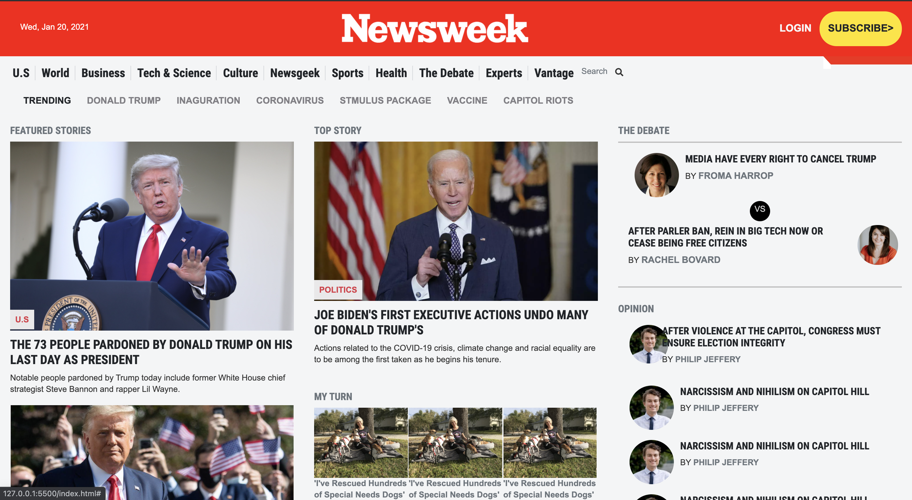

# Newsweek clone (Bootstrap)

> The project is a clone of the newsweek [website](https://web.archive.org/web/20210120125445/https://www.newsweek.com/).

# Built With:

- HTML
- CSS

# Framework:

-Bootstrap 5

## Live Demo
[Live Demo Link](https://mahbubul14.github.io/newsweek-clone/)

# Getting Started:

To get a local copy up and running follow these simple example steps.
Go to (https://mahbubul14.github.io/newsweek-clone/)

1. Click on the code and copy the HTML code.
2. Use terminal to clone this repository on your local machine.
3. Run git checkout -b your-branch-name. Make your contributions.
4. Push your branch up to your forked repository.
5. Open a Pull Request with a detailed description of the development branch of the original project for a review.

# Authors:

👤 **Mahbub Alam**

- GitHub: [@githubhandle](https://github.com/mahbubul14/)
- Twitter: [@twitterhandle](https://twitter.com/MahbubA10454419)
- LinkedIn: [LinkedIn](https://www.linkedin.com/in/mahbubul-alam-20595/)

👤 **Uzair Ali**

- GitHub: [@githubhandle](https://github.com/uzairali19)
- Twitter: [@twitterhandle](https://twitter.com/MahbubA10454419)
- LinkedIn: [LinkedIn](https://www.linkedin.com/in/uzair-ali-964187166/)

## 🤝 Contributing

Contributions, issues, and feature requests are welcome!

# Show your support

Give a ⭐️ if you like this project!
